# Octopoda Biodiversity Analysis

Global analysis of Octopoda occurrence records using OBIS data, Python, K-Means clustering, sea surface temperature (SST) trend modelling and Power BI.

## Project Overview

This project explores global Octopoda occurrence patterns and their environmental context using public biodiversity data from the Ocean Biodiversity Information System (OBIS).

The project follows an end-to-end data science workflow covering data cleaning, exploratory data analysis, spatial feature engineering, K-Means clustering, cluster validation, SST trend modelling, environmental relationship analysis and interactive Power BI visualisation.

Because the occurrence records are distributed globally, latitude and longitude were transformed into three-dimensional spherical coordinates before K-Means clustering. This reduces the distortion caused by treating the Earth as a flat two-dimensional surface.

The analysis is exploratory. OBIS occurrence records represent where organisms have been recorded and should not be interpreted as direct evidence of population abundance, migration or causal ecological change.

## Analytical Workflow

<p align="center">
  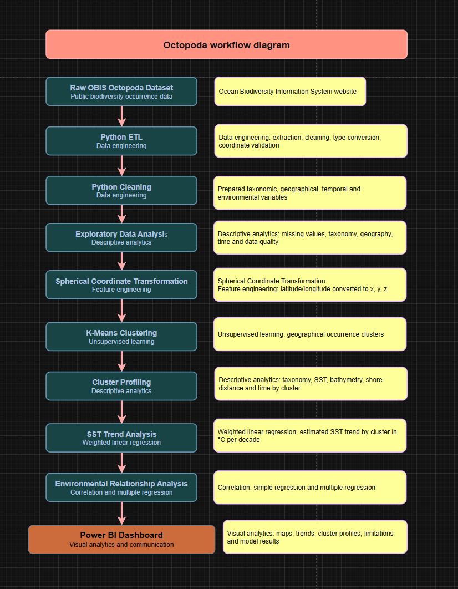
</p>

The workflow combines public biodiversity data, Python-based ETL and modelling, and Power BI reporting to move from raw occurrence records to geographical clustering, environmental trend analysis and interactive visualisation.

## Project Objectives

The project was designed to:

- Prepare and validate a global Octopoda occurrence dataset for analysis.
- Identify broad geographical occurrence patterns using K-Means clustering.
- Validate the clustering solution using the Elbow Method and Silhouette Score.
- Analyse regional sea surface temperature (SST) trends using weighted regression.
- Explore relationships between SST, bathymetry, depth and shore distance.
- Communicate results, data-quality issues and analytical limitations through Power BI.

## Data Source and Tools

The primary data source for this project is the [Ocean Biodiversity Information System (OBIS)](https://obis.org/), an open-access global marine biodiversity database containing occurrence records together with taxonomic, geographical, temporal and environmental information.

The analytical workflow was developed using:

- **Python** for data preparation, exploratory analysis and modelling.
- **pandas and NumPy** for data manipulation and feature engineering.
- **matplotlib** for exploratory visualisation.
- **scikit-learn** for K-Means clustering and regression.
- **statsmodels** for weighted regression analysis.
- **Google Colab** as the main notebook environment.
- **Power BI** for interactive dashboard development and communication of results.

## Data Engineering

The raw OBIS occurrence dataset contained a large number of taxonomic, geographical, temporal and environmental fields. The data engineering stage reduced this to the variables required for the analysis and prepared a consistent modelling dataset.

Key preparation steps included:

- Selecting relevant taxonomy, coordinate, temporal and environmental variables.
- Validating latitude and longitude values and checking coordinate completeness.
- Removing records containing the `ON_LAND` quality flag.
- Converting numerical fields such as SST, depth, bathymetry and shore distance to appropriate data types.
- Assessing missing values and duplicate occurrence patterns.
- Creating explicit display categories for missing taxonomic classifications.
- Producing cleaned, EDA-ready, clustered and dashboard-ready datasets.

### ETL and Coordinate Validation

<p align="center">
  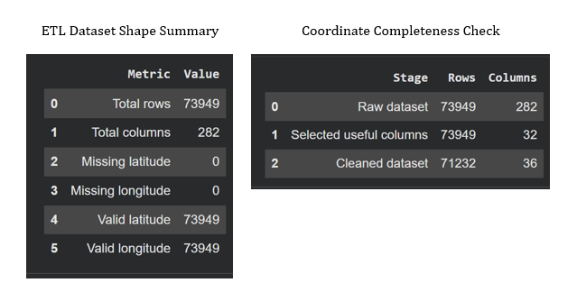
</p>

The ETL process confirmed that geographical coordinates were sufficiently complete for spatial modelling and reduced the original dataset to the fields required for analysis.

### Duplicate and Data Quality Checks

<p align="center">
  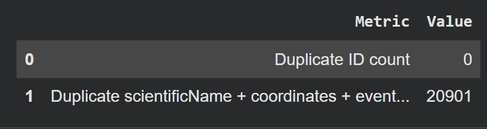
</p>

No duplicated record IDs were identified. However, 20,901 repeated combinations of scientific name, coordinates and event date were detected. These were retained cautiously because repeated combinations may represent legitimate occurrence observations rather than exact duplicate records.

<p align="center">
  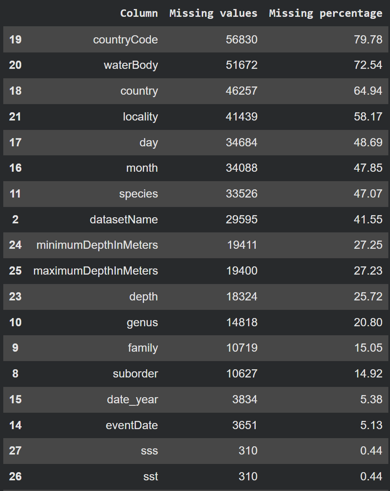
</p>

Missing-value analysis was used to determine which variables were suitable for modelling and which required more cautious interpretation.

### Taxonomic Completeness

<p align="center">
  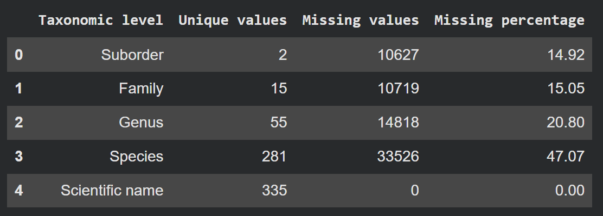
</p>

Scientific name was available for all records, while species-level identification had the greatest missingness at approximately 47%. The dashboard therefore preserves broader taxonomic levels and makes unidentified categories visible instead of silently excluding them.

## Spatial Feature Engineering and K-Means Clustering

### Spherical Coordinate Transformation

Applying K-Means directly to latitude and longitude would treat the Earth as a flat two-dimensional surface. To reduce this distortion, geographical coordinates were transformed into three-dimensional spherical coordinates (`x`, `y`, `z`) before clustering.

The original latitude and longitude values were retained for mapping and interpretation, while the transformed coordinates were used as the modelling features.

### Selecting the Number of Clusters

The number of clusters was evaluated across **K = 2–15** using two validation approaches:

- **Elbow Method** to examine reductions in within-cluster inertia.
- **Silhouette Score** to measure how well separated the resulting clusters were.

<p align="center">
  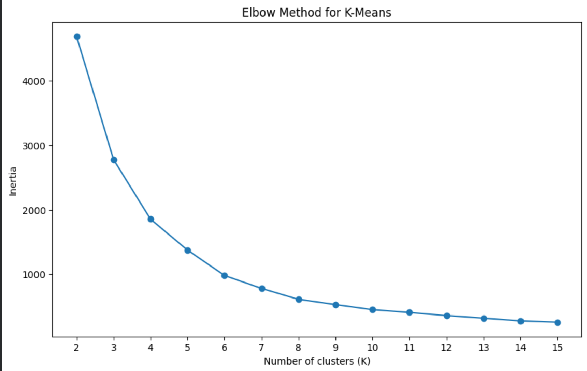
</p>


The elbow curve began to flatten around **K = 6–8**, indicating diminishing improvements in cluster compactness as additional clusters were introduced.

<p align="center">
  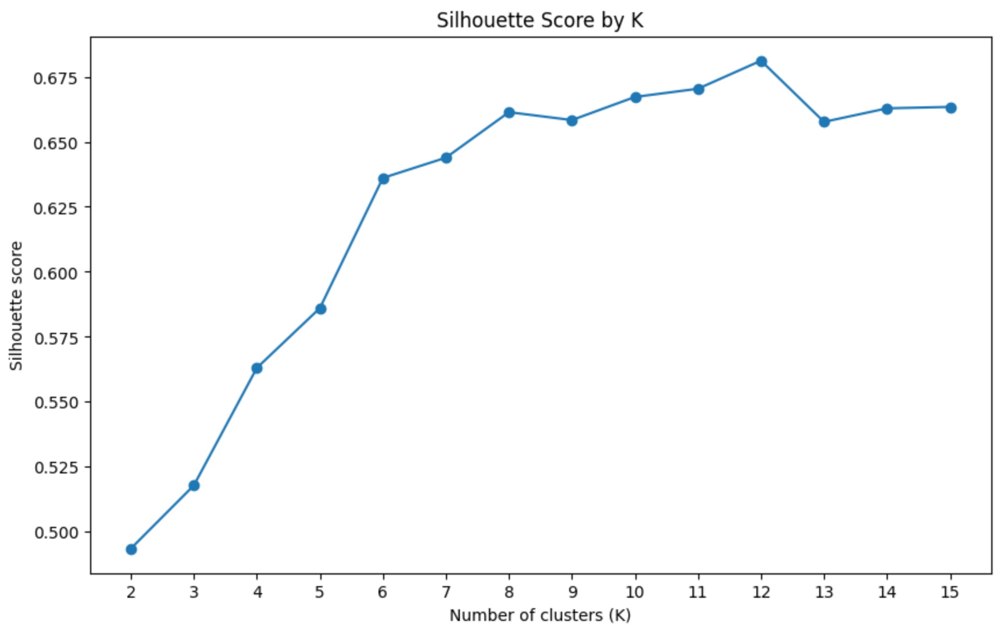
</p>

The Silhouette Score reached its highest value at **K = 12 (0.681195)** before declining at K = 13. Although the two validation methods did not identify exactly the same optimum, K = 12 provided the strongest cluster separation among the tested solutions while preserving useful geographical detail.

### Final Geographical Clusters

<p align="center">
  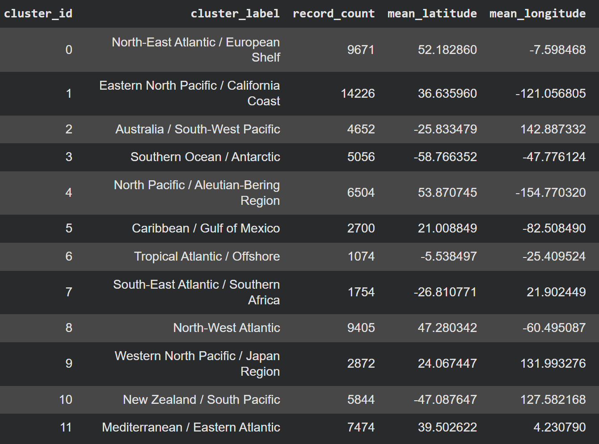
</p>

The final K-Means model produced **12 broad geographical clusters**. Cluster sizes varied considerably, from 1,074 records in the Tropical Atlantic / Offshore cluster to 14,226 records in the Eastern North Pacific / California Coast cluster.

<p align="center">
  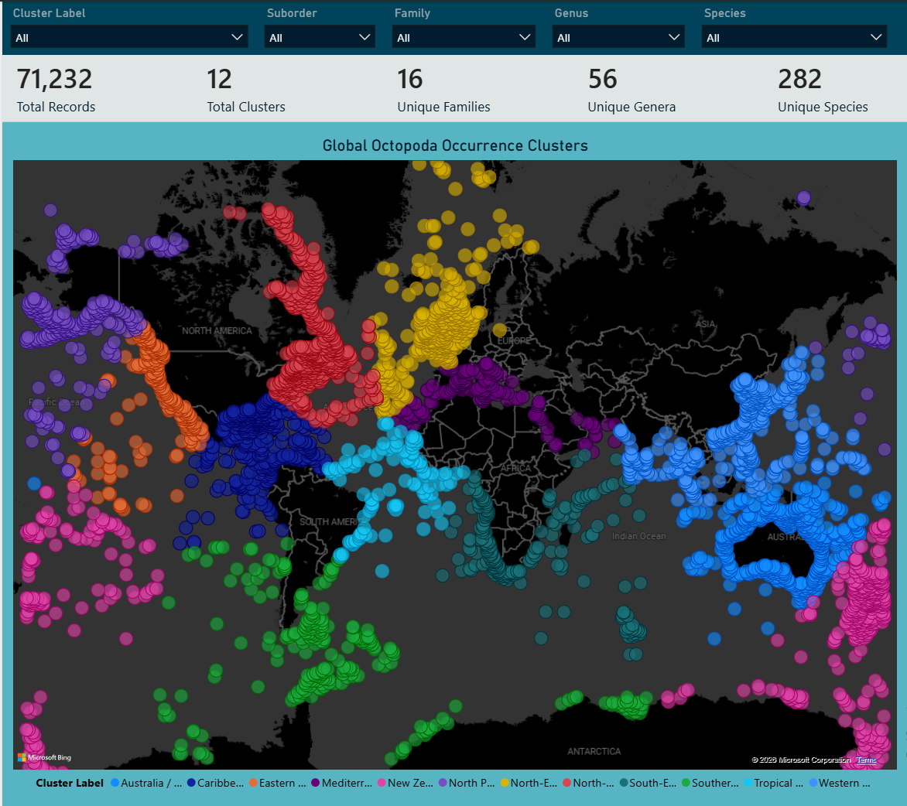
</p>

The resulting groups formed geographically interpretable regions across the Atlantic, Pacific, Southern Ocean and Mediterranean. These clusters were then used as regional analytical units for the subsequent environmental and SST trend analysis.

## Sea Surface Temperature Trend Analysis

A second analytical layer estimated regional sea surface temperature (SST) trends using weighted linear regression. The analysis was performed at cluster-year level, with yearly mean SST values weighted by the number of occurrence records available for each year.

To improve reliability, only cluster-years with at least **10 SST observations** were included in the regression. A cluster also required at least **3 qualifying years** to produce a valid temporal trend.

<p align="center">
  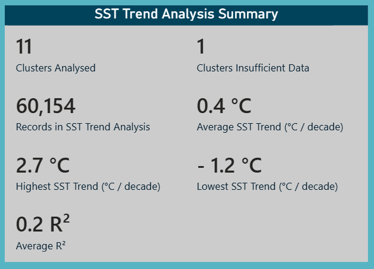
</p>

Of the 12 geographical clusters, **11 contained sufficient temporal data for SST trend modelling**, covering 60,154 occurrence records. The Tropical Atlantic / Offshore cluster was not modelled because only one year met the minimum requirement of 10 SST observations.

### Estimated SST Trends

<p align="center">
  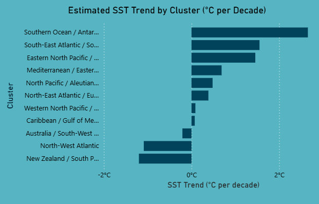
</p>

Estimated SST trends varied substantially between regions, ranging from approximately **-1.2 °C to 2.7 °C per decade**, with a mean estimated trend of approximately **0.4 °C per decade** across the analysed clusters.

<p align="center">
  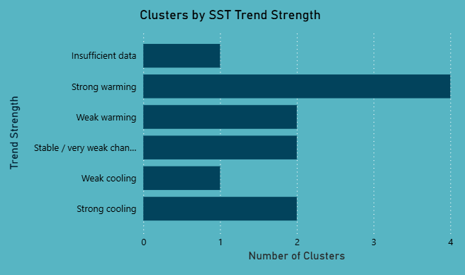
</p>

The 11 analysed clusters were classified into trend-strength categories:

- 4 strong warming
- 2 weak warming
- 2 stable / very weak change
- 1 weak cooling
- 2 strong cooling

### Cluster-Level Inspection

<p align="center">
  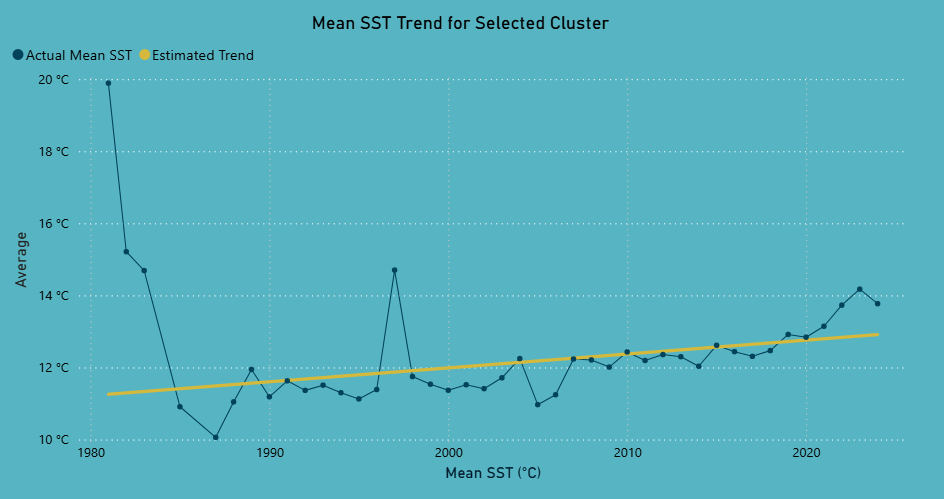
</p>

The Power BI dashboard allows individual clusters to be inspected in more detail, comparing observed yearly SST values with the estimated long-term regression trend.

### Weighting and Temporal Coverage

<p align="center">
  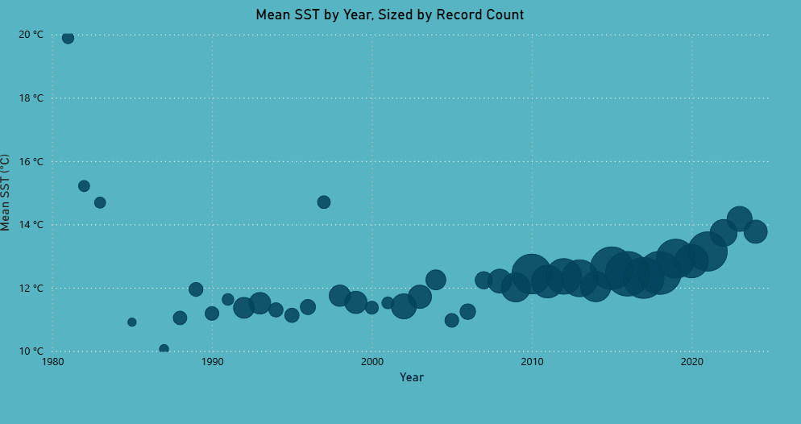
</p>

Record count was used as a regression weight so that cluster-years with more observations had greater influence on the estimated trend.

<p align="center">
  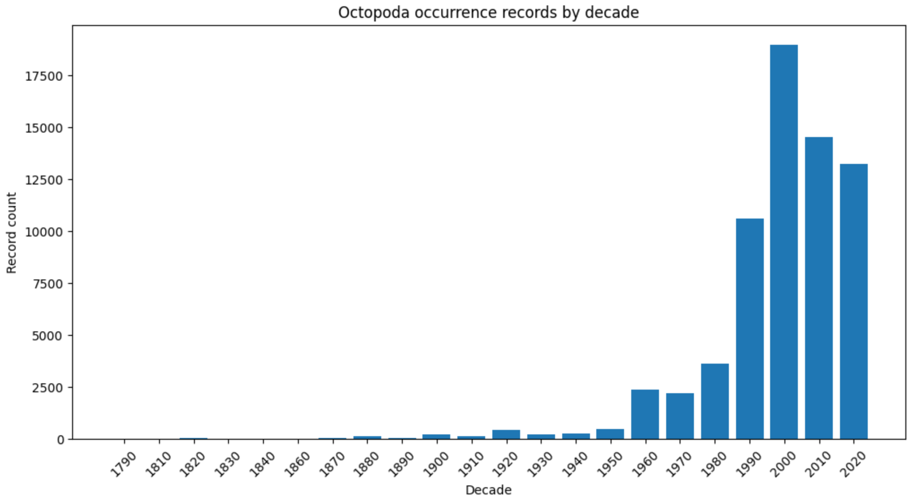
</p>

The strong increase in occurrence records from the 1980s onwards demonstrates why temporal results require cautious interpretation. Changes in the number of records may reflect sampling and publication effort as well as biological occurrence.

## Environmental Relationship Analysis

The final analytical layer explored whether sea surface temperature (SST) was associated with other environmental characteristics of the recorded occurrence locations.

The analysis considered:

- Bathymetry
- Depth
- Shore distance
- Recorded geographical context

Correlation and simple regression were first used to assess direct relationships. Multiple regression models were then used to examine whether explanatory power improved after accounting for **year** and **geographical cluster**.

<p align="center">
  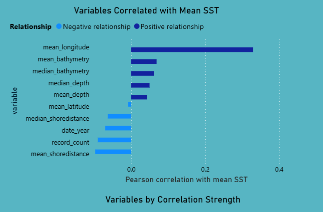
</p>

SST alone showed weak direct relationships with most of the environmental variables examined. This indicates that temperature by itself does not strongly explain the broader environmental context of Octopoda occurrence records.

<p align="center">
  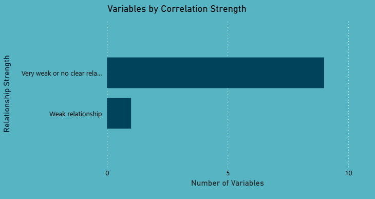
</p>

The multiple regression analysis provided stronger explanatory power after controlling for geographical cluster and year, suggesting that **regional and temporal context is more informative than SST alone**.

These results remain exploratory. They identify statistical relationships within the available occurrence data but do not demonstrate causal environmental effects, behavioural adaptation or migration.

## Power BI Dashboard

Power BI was used to transform the analytical outputs into an interactive data story that combines spatial patterns, taxonomy, environmental trends and data-quality limitations.

The dashboard was structured into dedicated pages so that users could move from a high-level overview to more detailed analysis.

### Cluster Analysis

<p align="center">
  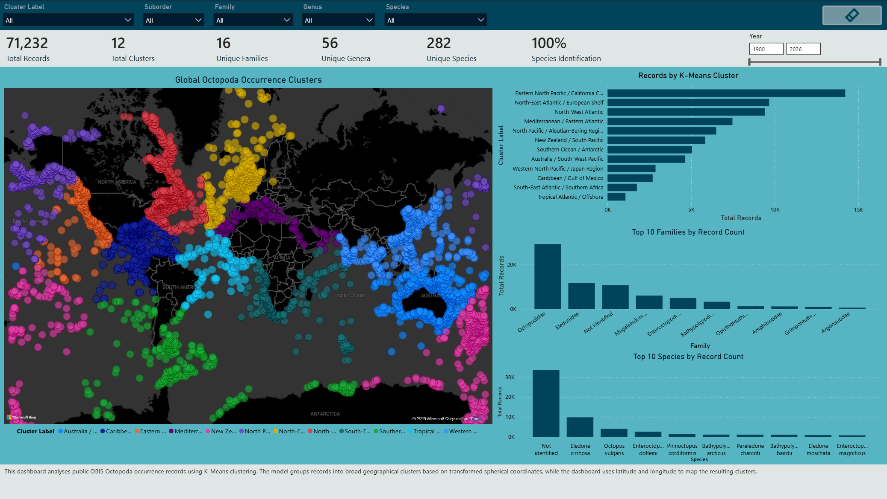
</p>

The Cluster Analysis page combines the global K-Means map with cluster record counts and dominant taxonomic groups. This allows geographical distribution patterns to be explored alongside the species and families associated with each region.

### Data Quality and Limitations

<p align="center">
  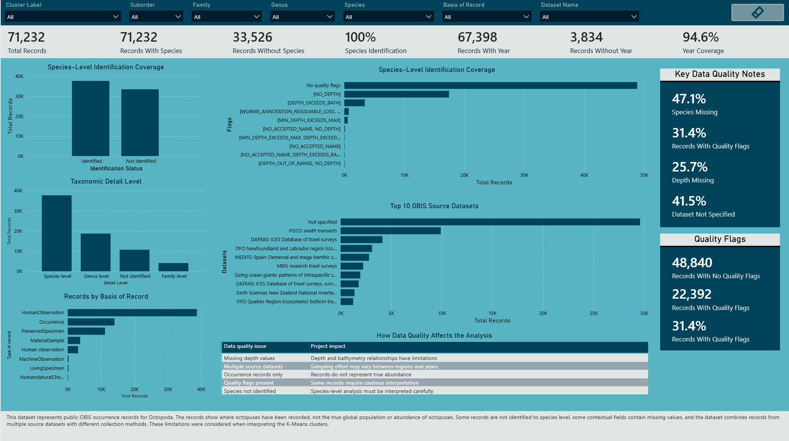
</p>

The Data Quality and Limitations page makes important source-data issues visible rather than hiding them. Key limitations include incomplete species-level identification, missing depth values, quality flags and records without a specified source dataset.

Additional dashboard pages were developed for:

- SST trend comparison between clusters
- Individual cluster SST trend inspection
- Environmental relationship analysis
- Taxonomic exploration
- Executive overview and summary metrics

The dashboard uses maps, cards, line charts, bar charts, scatter plots and summary tables to communicate the analytical results while keeping data quality and uncertainty visible.

## Key Findings

- **K = 12** was selected as the final clustering solution after comparing K = 2–15. The Silhouette Score reached its highest value at **0.681195**, while the Elbow Method suggested diminishing improvements from approximately K = 6–8 onwards.
- The 12 clusters formed geographically interpretable regions across major ocean areas, supporting their use as regional analytical units.
- **11 of the 12 clusters** contained sufficient temporal SST data for weighted trend modelling. Tropical Atlantic / Offshore was excluded because only one year met the minimum requirement of 10 SST observations.
- Estimated SST trends across the analysed clusters ranged from approximately **-1.2 °C to 2.7 °C per decade**, with a mean estimated trend of approximately **0.4 °C per decade**.
- SST alone showed generally weak relationships with the environmental variables examined.
- Models accounting for **geographical cluster and year** provided greater explanatory power, highlighting the importance of regional and temporal context.
- Data quality remains an important limitation. Occurrence records reflect reported observations and may be influenced by sampling effort, geographical coverage, taxonomic completeness and publication practices.


## Limitations and Future Work

The main limitation of the project is that OBIS occurrence records do not represent true population abundance. Areas with more records may reflect greater research activity, accessibility, reporting practices or data publication rather than higher Octopoda presence.

Environmental variables such as SST, bathymetry and shore distance describe the context of recorded occurrences, but they do not prove migration, behavioural adaptation or causal ecological change. Species-level interpretation also requires caution because a substantial proportion of records were not identified to species level.

Future work could extend the project by:

- Comparing OBIS records with additional biodiversity sources such as GBIF.
- Integrating external climate datasets from sources such as **NOAA** or **Copernicus**.
- Applying **Species Distribution Modelling (SDM)** for more formal ecological analysis.
- Improving automated validation, refresh and metadata tracking.
- Developing the workflow into a **horizon-scanning system** that periodically refreshes biodiversity and climate data to detect emerging regional patterns that may require further investigation.

## Conclusion

This project demonstrates an end-to-end data science workflow using public marine biodiversity data, from data preparation and spatial feature engineering through clustering, regression analysis and interactive dashboard communication.

The results show that global Octopoda occurrence records can reveal meaningful geographical and environmental patterns when analysed carefully. At the same time, the project highlights the importance of validating modelling decisions and communicating uncertainty, particularly when working with occurrence data affected by uneven sampling, incomplete taxonomy and changing recording effort.

## Repository Structure

```text
octopoda-biodiversity-analysis/
│
├── README.md
│
├── assets/
│   ├── workflow/
│   ├── data-quality/
│   ├── clustering/
│   ├── sst-analysis/
│   ├── environmental-analysis/
│   └── dashboard/
│
├── data/
├── docs/
├── notebooks/
├── powerbi/
└── references/